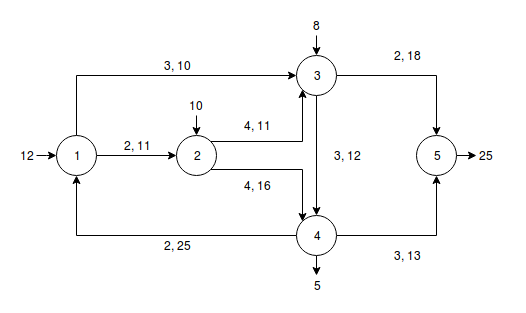

## Zadatak 1
**Simplex** metodom odrediti **maksimum** sledećeg optimizacionog problema:  
y = 5x1 + 4x2 + 3x3  
2x1 + 3x2 + x3 ≤ 5  
4x1 + x2 + 2x3 ≤ 11  
3x1 + 4x2 + 2x3 ≤ 8  
x1, x2, x3 ≥ 0
## Zadatak 2
Novi Sad i Sremska Kamenica snabdevaju se gasom iz tri međusobno povezana rezervoara. Na slici su prikazani tokovi kroz gasovode. Prvi broj iznad cevi označava cenu prevoza gasa, a drugi označava maksimalni kapacitet. Kapacitet prvog rezervoara je 12000, drugog 10000, a trećeg 8000 Potrebe Novog Sada su 25000, a Sremeske Kamenice 5000. Izračunati minimalnu cenu snabdevanja gasom ova 2 naselja.  

