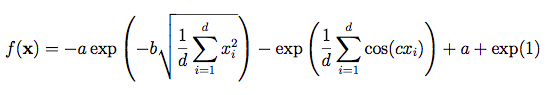
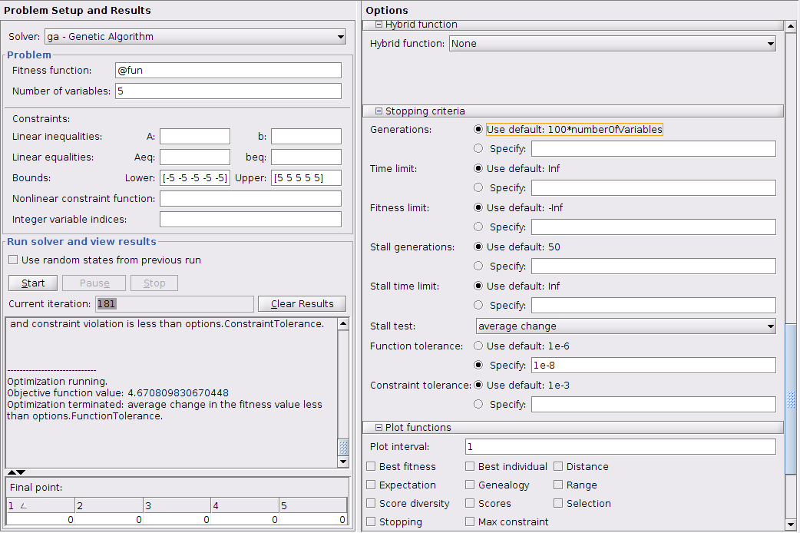
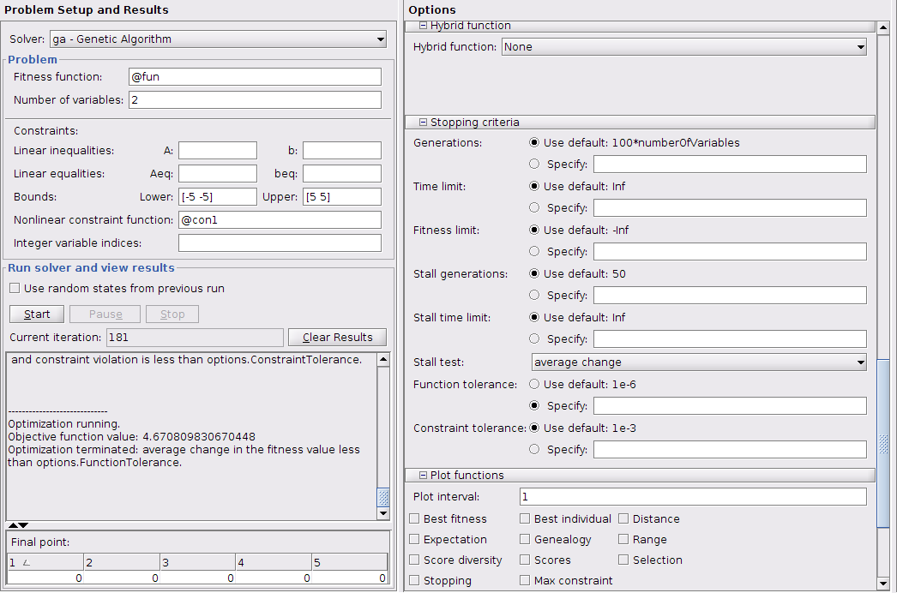
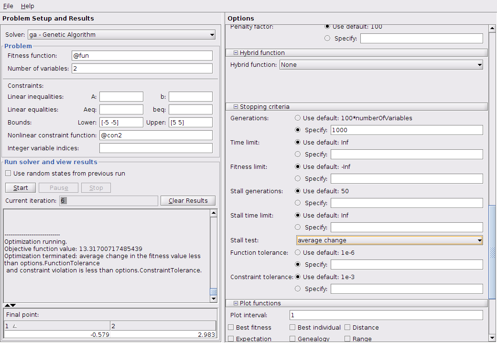

## Zadatak 1
Skicirati **Ackley** funkciju za dve promenljive na intervalu [-5, 5]  

## Zadatak 2
Odrediti optimum funkcije za slučaj 5 promenljivih sa tolerancijom 10^-8
## Zadatak 3
Odrediti optimum funkcije za slučaj 2 promenljive, ako je pretraga ograničena na tačke u x1x2 koje se nalaze iznad krive x2 = 1/x12
## Zadatak 4
Odrediti optimum funkcije za slučaj 2 promenljive, ako je pretraga ograničena na tačke u x1x2 koje se nalaze iznad krive iznad krive x2 = x12 + 2, tako da istovremeno važi ograničenje x2 = 1/x12. Zadatak uraditi sa podrazumevanim brojem generacija i sa 1000 generacija. Uporediti rezultate.
## Rešenja
### Zadatak 2

### Zadatak 3

### Zadatak 4
