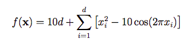

## Zadatak 1
Skicirati **Rastrigin** funkciju za dve promenljive na intervalu [-5, 5]  

## Zadatak 2
Odrediti optimum **Rastrigin** funkcije za slučaj 5 promenljivih koristeći **PSO** algoritam
## Zadatak 3
Koristeći **PSO** algoritam odrediti optimum **Rastrigin** funkcije za slučaj 2 promenljive, ako važi ograničenje  x2 = x12 - 2
## Zadatak 4
Koristeći **PSO** algoritam odrediti optimum **Rastrigin** funkcije za slučaj 2 promenljive, ako važe ograničenja  
-3x1 - 2x2+6 ≤ 0  
-x1 + x2 - 3 ≤ 0  
x1 + x2 - 7 ≤ 0  
2/3x1 - x2 - 4/3 ≤ 0